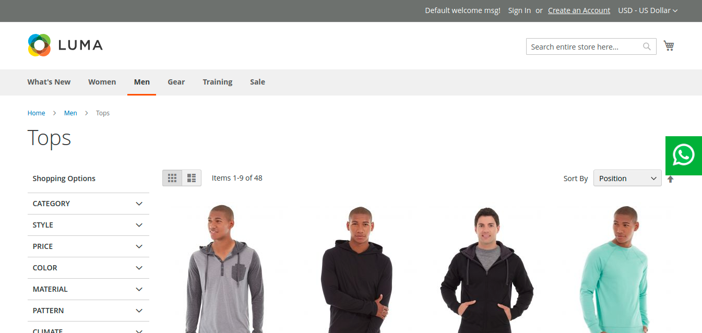
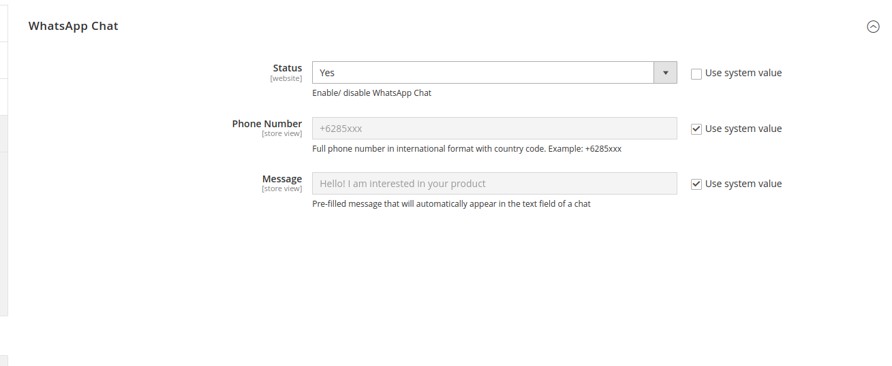

# M2Commerce: Magento 2 WhatsApp Integration

## Description

The module helps in integration WhatsApp with your website.

### Features
1. WhatsApp integration 
2. Compatible with 2.3.x and 2.4.x versions.

### Screenshot




## Installation
### Magento® Marketplace

This extension will also be available on the Magento® Marketplace when approved.

1. Go to Magento® 2 root folder
2. Require/Download this extension:

   Enter following commands to install extension.

   ```
   composer require m2commerce/zendesk-integration"
   ```

   Wait while composer is updated.

   #### OR

   You can also download code from this repo under Magento® 2 following directory:

    ```
    app/code/M2Commerce/ZendeskIntegration
    ```    

3. Enter following commands to enable the module:

   ```
   php bin/magento module:enable M2Commerce_ZendeskIntegration
   php bin/magento setup:upgrade
   php bin/magento setup:di:compile
   php bin/magento cache:clean
   php bin/magento cache:flush
   ```

4. If Magento® is running in production mode, deploy static content:

   ```
   php bin/magento setup:static-content:deploy
   ```
